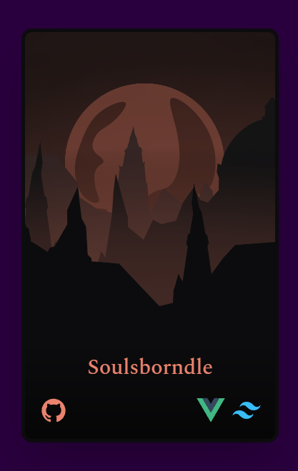
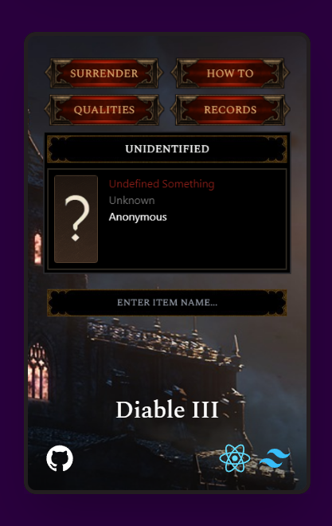
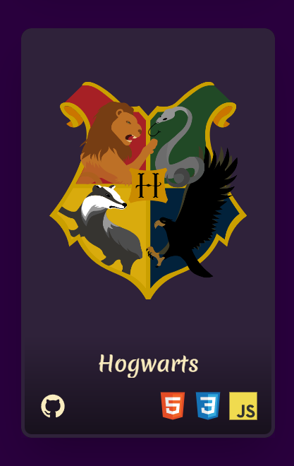

<!-- 
<a href="https://malthesers.github.io">
  <picture>
     <source media="(max-width: 768px)" srcset="images/title-card-mobile.png">
     
  </picture>
</a>

  <a href="https://github.com/malthesers/soulsborndle">
    <picture>
     <source media="(max-width:768px)" srcset="images/soulsborndle-card.png">
     
    </picture>
  </a>
  <a href="https://github.com/malthesers/diable-3">
    <picture>
     <source media="(max-width:768px)" srcset="images/diable-3-card.png">
     
    </picture>
  </a>
  <a href="https://github.com/malthesers/hogwarts">
    <picture>
     
    </picture>
  </a>

-->
